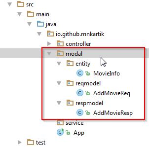

# convert request json to dto and then to entity

In this article will get to know about an approach to convert the json to DTO beans using Jackson built in convertors and `@RequestBody` annoatation.

Here we will take an example of  

Lets say if we have below RESTful operations where we need to pass many properties esp where in we need to create an entity, in such cases, converting it into an object and using the same is a tidy approach.

For example we have a service like `Insert movie info` where below is the schema ( shown in concise way ),

### Insert movie info

#### Request 	

	{	  
	  "title": "Toy Story 3",
	  "year": 2010
	}						

#### Response
	
	{
	  "status" : "success",
	  "data" : {
	    "id" : 100
	  }
	}

##### Listing 1:  

	public class AddMovieReq {

        // [1]
	    @JsonProperty("title")
	    private String movieTitle;
	   
		@JsonProperty("year")
	    private int year;

        // ... getters and setters   

		// [2] 
	    public MovieInfo convert(){
	        return new MovieInfo(this.movieTitle,this.year);
	    }      
	}	

From this listing 1, 

[1]: The request data is converted to the below bean based on the mappings applied to the respective properties.

[2]: this method converts the View model ( AddMovieReq bean) to entity used from Service and DAO layers. 

 

##### Listing 2: 

From this listing-2, after calling service call from controller, response is built using below class. This class returns the data as per the response specification. 
	
	public class AddMovieResp {
	
	    public String buildResponse(String status, int movieId){
	        String responseJson = null;
	        Map dataMap = new HashMap();
	        Map resultMap = new HashMap();
	        ObjectMapper mapper = new ObjectMapper();
	
	        try {
	            dataMap.put("movie_id", movieId);
	
	            // set result map
	            resultMap.put("status", status);
	            resultMap.put("data", dataMap);
	
	            // conversion
	            responseJson = new ObjectMapper().writeValueAsString(resultMap);
	
	        }catch (Exception e){
	            throw new RuntimeException(e.getMessage());
	        }
	
	        return responseJson;
	    }
	}
    

> NOTE: The specification could be different and so does the function logic but putting the logic in different classes for response and request would ensure clean code.

For success response, above function is used, but for error, usually a utility class is used, common for all the rest services in error conditions.

### List Movie Service

#### Response Spec

	{
	  status : "success",
	  data : {
	     movies : [
	         {	  
		        "title": "Toy Story 3",
		        "year": 2010
	      	 },
	         ..
	         ..
	     ] 
	  }
	}

##### Listing 3: 
	
	public class ListMovieResp {
	
	    public String buildResponse(String status, List<MovieInfo> list){
	        String responseJson = null;
	        Map dataMap = new HashMap();
	        Map resultMap = new HashMap();
	        ObjectMapper mapper = new ObjectMapper();
	
	        try {
	            ArrayNode arrnode = mapper.createArrayNode();
	            for(MovieInfo info : list){
	                ObjectNode o = mapper.createObjectNode();
	                o.put("id", info.getId());
	                o.put("title", info.getTitle());
	                o.put("year", info.getYear());
	
	                arrnode.add(o);
	            }
	            dataMap.put("movies", arrnode);
	
	            // set result map
	            resultMap.put("status", status);
	            resultMap.put("data", dataMap);
	
	            // conversion
	            responseJson = new ObjectMapper().writeValueAsString(resultMap);
	
	        }catch (Exception e){
	            throw new RuntimeException(e.getMessage());
	        }
	
	        return responseJson;
	    }
	}    

#### Suggested Folder structure :

 

 